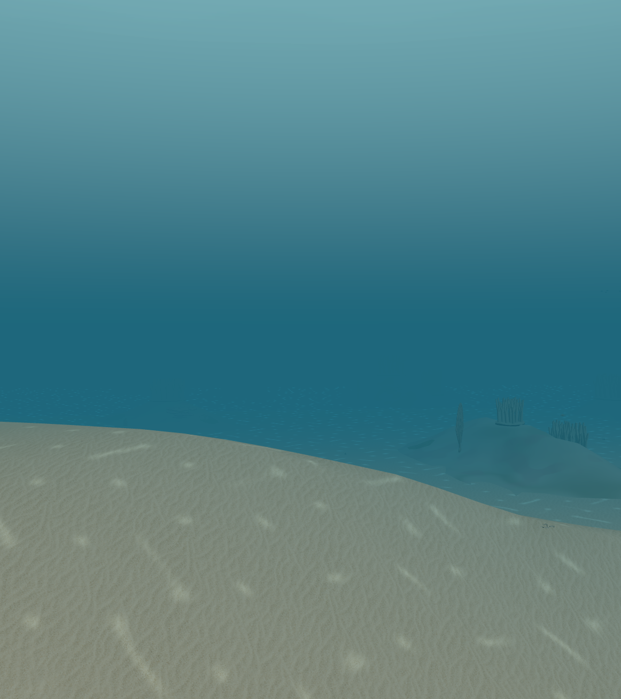

# 当前状态与后续步骤

2026-10-06 新增巨藻林四区生活带：在适宜且全新区域中连接高巨藻群、原岩底、林下低冠、天然沉积空隙与现有动物。原床面与所有旧元素保留；完整计划、实际出生和初始库存共同保存后显示。已有区域保持原貌，完整林带缺失或损坏成员拒绝重建。普通探索与导演均新增“巨藻林带 / 林缘空地”两个入口，导演共38章、1×观察时间448秒，加载另计。

本轮257项当前整合检查全部通过、一次生产构建通过；云端将运行同一检查集合，不累计重复次数。示例四区有49株高巨藻描述符（追加16株）、31株林下植物、46条真实动物记录和7个模拟巨藻代表，原食物模型继续消费实际库存。整个九区活动窗口两秒CPU模拟中60个动物实际位移、摄食0.0186相对单位，食物收支最大误差约8.89e-16。完整旧死亡/历史、保存失败不公开、离屏冻结、全窗口卸载/回访/冷恢复及有界远移通过。 见[模型说明](KELP_FOREST_BELT.md)与[实际记录](../output/validation/kelp-forest-belt-model.json)。本轮仅有CPU/Three/保存证据，没有新增浏览器观看或视觉验收；有限宏观内容包收口，后续继续整体地域与生态组合，避免单体/叶片/镜头微调。以下保留先前交付历史。

2026-10-06 本轮补充草床海龟摄食：浅海生态海域中的原个体接近现有海草叶片静态几何参考点后才消费原海草有机库存；接近/取食/离开与成功历史分别显示，换气优先。摄食残余、库存损失和死亡回流接入原基础网络。可选升级先共同保存，保留旧个体、死亡、地形、时钟及历史；一次性龟有机输入明确记账，回访不重复、不补活。有限接触、参数与GPU摆动边界见[模型说明](TURTLE_GRAZING.md)。本包收口后继续整体地域与生态组合，不进入单龟/叶片/镜头微调。

本轮167项当前整合检查（0失败）及最终生产构建通过；同次普通模拟中，原6,3海龟在24.3模拟秒首次取食0.0005相对单位，独立原叶片网格接触参考距离约2.16e-11米，食物/物质账误差低于2.4e-14。初次构建也通过，取食死亡保存边界修复后再次构建，共两次；不把重复检查相加。先前独立旧渲染回归暴露过时文案断言与整文件哈希，现保留实际原几何/动画/资源回归及旧生态冻结对照。证据见[本轮记录](../output/validation/turtle-grazing-delivery.json)。没有新增浏览器观看或视觉验收。

源码`04e1db8`已发布：[运行37419920460](https://github.com/yydshly/ocean-world/actions/runs/37419920460)构建、167项当前整合检查（0失败）与Pages部署全部success，部署`6876661769`状态success。云端与本机同一167项，不相加。刷新[线上导演](https://yydshly.github.io/ocean-world/?demo=director)后，在草床章退出导览并用“观察草床海龟”跟随实际活体；档案显示成功次数，生态变化显示海草库存。发布成功不替代浏览器实际画面验收。

本轮新增v5完整生活带：适宜且四区全部未访问时，一次组织礁丘珊瑚、原生砂道、草床与水层，真实动物/食物库存/计划保存成功后共同显示。固定组合74,2新增4块礁丘、210处草根，四区66个真实动物，九区窗口147个；两秒CPU模拟中54个实际位移、37次摄食。旧存档及死亡不重建，原床面不变；119项整合检查和一次构建通过。普通路线/导演新增“生活带：礁群沙道”和“生活带：草床水层”，导演共36章。工具当前拒绝浏览器访问，因此本轮没有新增实际整景观看/截图验收。有限功能包收口；整体形象与普通视距可辨识度仍须实际观看，后续继续优先宏观地域与完整生命组合。

更新：2026-10-06。此文归纳当前开发版，历史阶段与原始证据保留在 [开发记录](../PROGRESS.md)、[完整路线图](../PLAN.md) 和 [原 README 全文](HISTORICAL_README.md)。[GitHub 仓库](https://github.com/yydshly/ocean-world)已公开，[在线体验](https://yydshly.github.io/ocean-world/)已发布，见 [部署说明](DEPLOYMENT.md)。

## 项目定位

建设海洋纪录片式的海底观察世界：自然水下光照、真实比例、安静自由探索；按种子持续生成连贯生活空间，让动物、植物与环境关系共同出现在普通探索中。

当前是可持续探索的模拟原型。技术与保存基础已经形成，主要缺口是宏观内容的连贯性、普通视距的生命可见性和自然形象。功能数量、目录条目与检查通过均不能替代画面验收。

现在可以打开 [一键导演入口](https://yydshly.github.io/ocean-world/?demo=director)，镜头自动前进、转向和升降，顺序巡游四类海域、13 个浅海及 2 个巨藻林生活带观察点、真实动物和现有工具。1× 约 7 分半加加载，可用“巡游速度”选择 0.5×–4×，实际镜头走完才换章；可暂停、跳章、结束后选章重看或退出。巡游改速保留当前路径，不改变生态时间速度；图鉴选择、手记回访和开始录像转为自主观察。手动 [能力总览](https://yydshly.github.io/ocean-world/?demo=all) 仍保留；详细范围见 [导演说明](DIRECTOR_ENTRY.md)，发布状态见 [部署记录](DEPLOYMENT.md)。

## 已实现的整体能力

| 部分 | 当前实现 | 实际边界 |
| --- | --- | --- |
| 海域 | 默认新浅海，以及原浅礁、蒙特雷巨藻林、东北太平洋深海软底 | 四个入口分别切换；还不能沿同一地理世界连续游过全部气候与深度带 |
| 生成与探索 | 世界坐标与种子生成、64 米区块、九区活动窗口、浮动原点；路线外持续生成 | 加载单位不是海洋边界；内存与活动计算有界，未加载区域冻结 |
| 宏观地貌 | 不规则礁石、岩脊/岩沟、分散礁丘/砂道、草床边缘、缓坡/砂盆，以及最新四区连续床面 | 保存过的地貌保持；新组合受原宿主和边界支撑约束，尚非无界单一地质场 |
| 植物与附着群落 | 海草沉积底扎根、巨藻硬底附着、珊瑚/藻膜/海绵的真实宿主支撑 | 显示实例、代表个体和生态库存有区别；增加叶片或群冠不会增加生物量 |
| 动物 | 鱼群、底栖动物、海龟、蝠鲼、章鱼、蟹、海绵、礁鱿、水母及深海分类代表 | 形体和行为是有限近似；不保证每区出现全部类别或每个视角都能看见 |
| 生态 | 生产/输入、摄食、局部捕食与避敌、死亡入碎屑、分解回流、系统输出和账目 | 未校准相对单位；浮游、微生物和部分猎物为群体代理，完整繁殖与生命周期缺失 |
| 环境 | 深度光照、昼夜、当地水流、浑浊、颗粒与随流摆动；深海观察灯 | 主要为定性模型，没有完整流体、潮位/波浪或沉积输运求解；灯不供生态能量 |
| 探索元素 | 稀疏沉木、开口灌水沉底瓶，5.5 米三维近距发现，最近 64 条发现记录 | 瓶为沉底状态，未实现长期漂流、动态物体保存或完整视线识别 |
| 保存与观察 | 个体及历史死亡、地形计划、库存/账目、环境/时刻、最后视点与最多 12 个观察点 | 本机浏览器 IndexedDB；无云端同步，域名/浏览器/设备之间不自动共享 |

当前目录：**新浅海 23 条、原浅礁 18 条、巨藻林 8 条、深海 4 条**。这些是各海域的独立目录条目，包含群体、复合体与属/科/门级代理；不能直接相加宣称为严格物种数量，也不表示已经覆盖完整海洋生态。

## 最新交付：统一能力演示入口

[能力总览](https://yydshly.github.io/ocean-world/?demo=all)集中四类海域、13个新浅海地貌与生活带观察点、生物/环境、独立工作台与记录工具。最初11个地貌点及主要入口的线上核对、33项检查和发布见[历史入口记录](DEMO_ENTRY_AUDIT.md)，当时下载请求已验证而文件回执未核验。新增生活带两点已通过本批CPU入口/模型/渲染几何检查，尚无新浏览器画面核对；旧动物保留，物种目录未扩大。

## 上一整体交付：128 米四区连续海床

仅当适宜的相邻 2×2 新浅海区域尚未访问，且四份已存记录都确实为空时，才采用 v4 连续海床计划。共享 129×129 绝对床面切成四张 65×65 网格，内部边界高度完全一致。四区地形、实际出生记录和初始库存通过一次保存后，才一起公开给显示与模拟。

显示、水深、生物出生/支撑和相机读取同一床面。外围 16 米原地床带和完整原岩体、草根、道具足迹保留；内部可变跨度约 96 米。候选与坡度限制为有限计算，条件不适宜就回退旧生成路径。已访问的 legacy/v1/v2/v3 地貌保持，历史死亡不补齐，库存不重置，未进入活动窗口的成员保存并冻结。

实际示例由 54,8 / 55,8 / 54,9 / 55,9 四区组成：

- 起伏高差 **4.654 米**，最大三角坡度约 **0.650**。
- 内部一段 **13 米**接缝两侧相对原床共同抬升至少 1 米。
- 54,9 的 **100 处原草根与沉木**保持，现有真实群落读取相同生境。
- 已沿“连续海床→相邻生境”普通路线实际行进 64 米，随后使用既有全景功能观察。
- 首次窗口 120 个活体、最终整景窗口 119 个活体；窗口变化来自活动区域变化，共有区域的完整记录保持。

这批新增的是共同地貌与真实生境连接，没有增加物种或另加装饰动物层。内部连续不代表整个无界世界已经成为统一地质地表，也不是实测水深图或地形耦合流体模型。

## 已有验证与未验收项

最新包 **19 项不同相关检查**通过：共享床面/支撑 4 项、真实渲染/源提交 3 项、真实出生/库存/失败/兼容/恢复 4 项、生产启用和原世界集成 8 项；一次生产构建通过。范围限定本批改动，**不声称全项目历史测试全绿**。旧冻结版长期性能报告也不覆盖当前源码。

实际浏览器已完成普通跨区行进、全九区卸载、回访及冷刷新。旧窗口的 132 条完整动物和九区状态保持；新整景窗口的 119 条完整动物、九区地形/生态/库存、环境、时钟和发现保持。原八条完整观察点保留，新增后十条完整手记回访/刷新相同。实际运行和保存错误为零。

记录见 [连续海床交付报告](../output/validation/seascape-delivery.json) 和独立的 [手记观察](../output/validation/seascape-notes-observation.json)。完整捕获曾超过开发工具原 2 MiB 配额，原 PNG 保留且没有虚构元数据；改为无损紧凑 JSON 后，同配额下完成完整写入与刷新验证。

图中能看到连接的沙坡，但草床和小动物在普通远景仍难辨认，水体占比大，旧岩体/珊瑚与动物轮廓仍显程序化。**纪录片式整体画面尚未验收**，这一批停止坡面、镜头、叶片、材质和单体的细调循环。

## 接下来的有限实现步骤

下一阶段交付一段普通探索中能辨认的完整生活带，先整片内容，再深化局部。每批都保留旧存档，并用一次实际路线验收收口。

1. **定义一段完整宏观路线。** 用礁体主体、开放砂道、草床边缘和水层构成连续的空间节奏；先确定大尺度分布与真实支撑，沿普通视角能看出各带区别。
2. **同批组织真实生命。** 让附着/滤食、草食、碎屑食、游动鱼群与捕食代表占据相应生境，共享支撑、准入和食物库存；只有明确类别缺口时再成批扩展代表，保留分类层级。
3. **一次性交付整体场景。** 地貌、底质、群落与稀疏探索物进入同一持久计划；新生成只作用于符合条件的未访问区域，不用镜头切换或装饰个体替代生活空间。
4. **完成有限验收。** 相关模型/渲染/保存检查、一次生产构建、普通路线实际行进，以及暂停、离开回访、刷新后的完整记录比较。检查通过后交付整片结果，不无限加验或局部微调。
5. **按整体缺口进入后续批次。** 再补不同地貌与稀疏事件、生命周期和环境耦合；每项明确模型范围与可见变化，再决定是否深化资产与细节。

本次 GitHub 与 Web 发布用于建立可访问的版本基线。线上站点会建立自己的本地存档，不自动继承当前本机浏览器中的海域、动物或观察手记。
