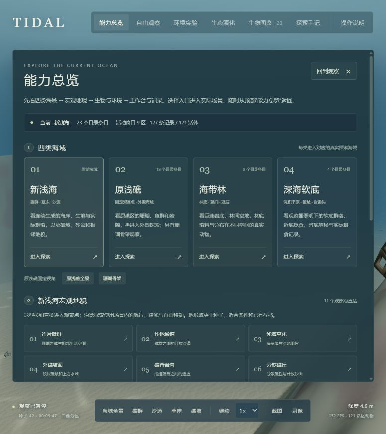

# 统一演示入口与线上核对

2026-10-06。打开 [能力总览](https://yydshly.github.io/ocean-world/?demo=all)，或点击任意场景顶部的“能力总览”。四类海域、11 个新浅海地貌观察点、生物与环境、工作台与记录集中在这里。

## 实际核对结果

| 入口 | 线上结果 | 范围 |
| --- | --- | --- |
| 新浅海 | 可进入，九区加载完成；最终读取 127 条记录、121 个活体，保存错误与运行错误为 0 | 目录 23 条；活体数量随当前窗口和历史状态变化 |
| 原浅礁 | 固定观察区可进入，扫描珊瑚骨架资料可打开 | 目录 18 条；外围连续海域仍通过原探索按钮进入 |
| 海带林 | 总览直接启动连续探索，九区加载完成；林缘群落观察可用 | 目录 8 条；曾读取 129 个活体 |
| 深海软底 | 总览直接启动连续探索，九区加载完成；选中真实海蜘蛛个体 | 目录 4 条；曾读取 80 个活体；没有阳光供能 |
| 11 个地貌点 | 逐一进入实际坐标，读取真实生境、加载与群落状态 | 这是观察点直达；场景内路线、邻格和巡航仍是普通移动。两次早期读数仍有邻区加载，随后补查为九区、零加载 |
| 图鉴与附近生物 | 从图鉴选中实际绿光鳃雀鲷并跟随；附近生物入口选中实际裂唇鱼 | 缺少活体的条目保持灰色，不为演示补生 |
| 环境面板 | 当前环境与生态读数正常；实际水流滑条 0.15→0.16→0.15，四个环境字段全部恢复原值 | 深海另有观察灯开关；未自动套用干预或基线 |
| 食物网工作台 | 同种子对照曲线可见 | 独立概念性功能群模型 |
| 年龄结构工作台 | Worker 计算完成，生命周期曲线和账本可见 | 独立教学模型，不修改三维动物 |
| 探索手记、浅海发现 | 当前来源的手记与发现面板可打开 | 本次未创建/删除观察点，也未自动伪造发现记录 |
| 截图、录像、数据 | 录像实际启动及结束；截图、视频/元数据、JSON 均发起下载请求 | 自动化环境没有取得下载文件回执，未核验下载文件内容 |
| 窄屏入口 | 390×844 本机检查：按钮可见、总览可滚动，无横向溢出 | 已修复生产 CSS 中旧 first-child 隐藏规则的覆盖 |

最后的运行诊断与控制台错误列表均为空。检查中暂时暂停模拟、保持 1×，没有使用重置或更改种子。默认首页仍尊重浏览器上次选择的世界；演示 URL 只打开总览，不强制重建生态。

## 修复与发布

总览切换先核对实际 renderer 和快照所属的海域/浅海模式，加载完成后只执行最新入口。关闭总览或手动切换海域会取消待执行动作。海带林、深海卡片使用原连续探索方法；11 个新浅海入口按实际生成器的 route ID 查找，缺失不会静默回退到第一个点。线上导出提示改为“已请求下载”，避免把请求误报为文件已落盘。

功能版本 `70ef50880d82ef8bf924795e3086b07bbab337b4` 首次上线并开始路线核对；最终版本 `088b6d214922a9e3a150df458a0f753f79f6eac6` 只补充窄屏按钮的 CSS 优先级。后者的 [发布运行 37349644714](https://github.com/yydshly/ocean-world/actions/runs/37349644714) 构建、33 项相关检查和部署均成功，部署 `6865814471` 返回 success。最终版本又核对了四类海域中的原浅礁、海带林、深海与新浅海、两个工作台和记录工具。

浏览器自动化部分等待发生了 3 秒超时，后续实际界面及诊断确认对应场景已完成加载；这些超时不计为验证成功，也没有靠重新生成动物解决。隐藏诊断 output 的文本定位等待不可靠，实际读数通过只读 DOM 解析获得。没有进行全历史测试、长期性能、全部稀有生物或纪录片画面验收。

原始记录：[入口读数](../output/validation/demo-entry-audit.json)、[本机相关检查](../output/validation/demo-entry-checks.log)、[构建日志](../output/validation/demo-entry-build.log)。

